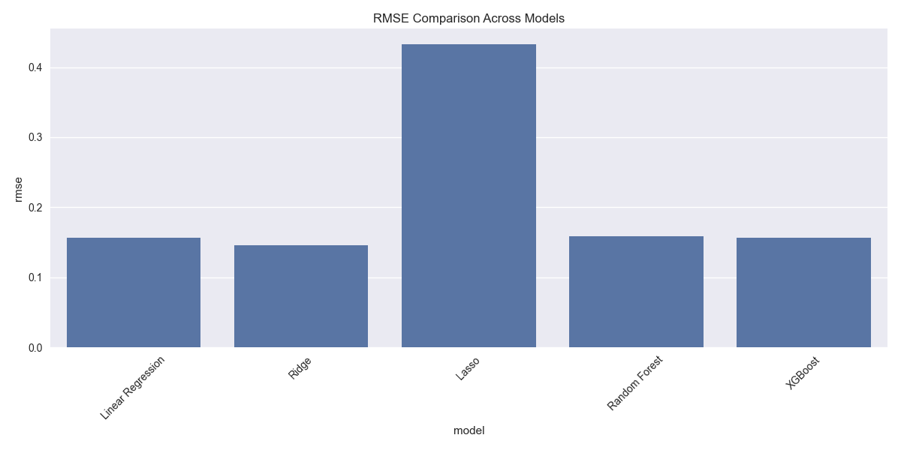
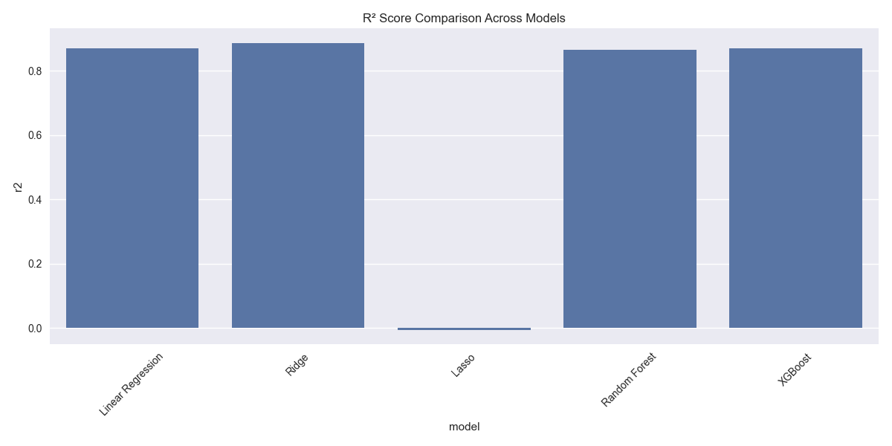
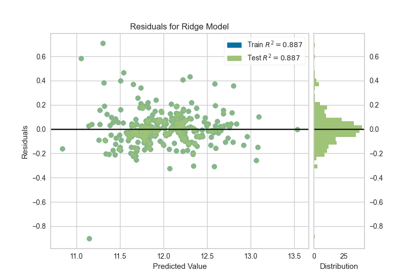
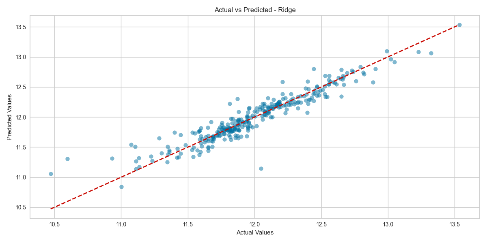

# 🏡 House Price Prediction

An end-to-end machine learning solution to predict house prices based on real estate data. This project walks through data cleaning, feature engineering, model training, evaluation, and a deployed Streamlit app for interactive predictions.

---

## 📌 Problem Statement

To predict the sale price of residential homes using various property features. The objective is to build a regression model that minimizes prediction error and generalizes well to unseen data.

---

## 📊 Dataset

- **Competition:** [House Prices - Advanced Regression Techniques (Kaggle)](https://www.kaggle.com/competitions/house-prices-advanced-regression-techniques)
- **Files Required:**
  - `train.csv`, `test.csv`
  - `data_description.txt`
  - `sample_submission.csv`
- 📁 Place them in the `/data/` directory (ignored via `.gitignore`)

---

## 🛠️ Tech Stack

- **Languages & Libraries:** Python, Pandas, NumPy, Scikit-learn, XGBoost
- **Visualization:** Matplotlib, Seaborn
- **Deployment:** Streamlit
- **Storage:** joblib (for saving models/pipelines)

---

## 📈 Workflow

1. Data Cleaning & Exploratory Data Analysis (EDA)
2. Feature Engineering & Transformation
3. Model Training (Linear, Ridge, Lasso, Random Forest, XGBoost)
4. Performance Evaluation (RMSE, R²)
5. Streamlit App Deployment

---

## 🧱 Project Structure

```
house-price-prediction/
├── data/                 # Raw CSVs (ignored in Git)
├── notebooks/            # EDA and experimentation
├── src/                  # Core scripts (preprocessing, modeling)
├── app/                  # Streamlit deployment app
├── output/               # Model files, pipeline, and plots
├── screenshots/          # Screenshots for README
├── requirements.txt      # Project dependencies
├── .gitignore            # Git ignore rules
├── LICENSE               # MIT License
└── README.md             # Project documentation
```

---

## 🚀 How to Run

```bash
pip install -r requirements.txt
streamlit run deploy/app.py
```

---

## 🌐 Live Demo

🔗 [Try the Deployed Streamlit App](https://house-price-pratt.streamlit.app)

---

## 📌 Results

- ✅ **Best Model:** Ridge Regression  
- 📉 **Lowest RMSE:** `0.145`  
- 📈 **Highest R²:** `0.887`  

> Ridge Regression outperformed others in both RMSE and R², indicating strong predictive power. Lasso underperformed due to aggressive regularization. Ensemble models like Random Forest and XGBoost performed competitively but with slightly higher error.

**RMSE in log units** ≈ `0.145` translates to ~$14,500 average deviation in real-world price scale.

| Model              | RMSE   | R²      |
|--------------------|--------|---------|
| Linear Regression  | 0.156  | 0.870   |
| **Ridge**          | 0.145  | 0.887 ✅ |
| Lasso              | 0.433  | -0.006  |
| Random Forest      | 0.159  | 0.865   |
| XGBoost            | 0.156  | 0.869   |

---

## 📊 Model Visuals

### 📌 RMSE & R² Comparison



### 📉 Residuals & Predictions (Ridge)



---

## 📸 Screenshots

### Streamlit App UI


### Feature Importance Plot


### Residuals vs Predictions


---

## 🧠 Future Improvements

- Hyperparameter tuning with `GridSearchCV` or `Optuna`
- Model explainability with SHAP
- Cross-validation to reduce overfitting
- Location-based price maps using Folium/GeoPandas

---

## 🪪 License

MIT License © 2025 Pratik Arvind Shirsath

---

> For best results, ensure your `requirements.txt` pins the same scikit-learn version used during model training.
